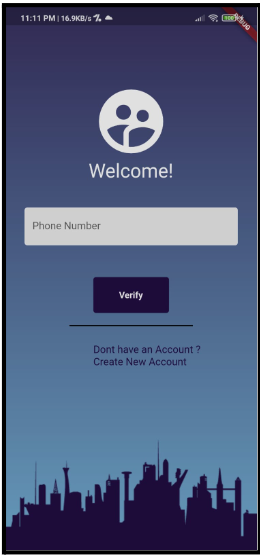
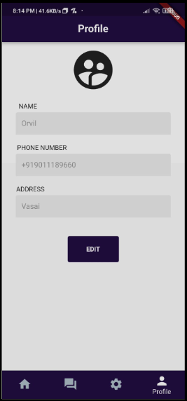
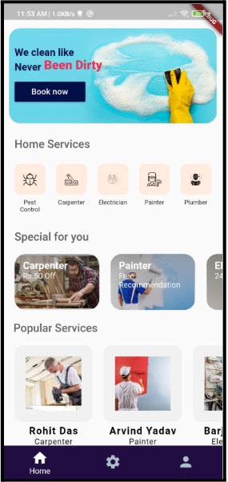
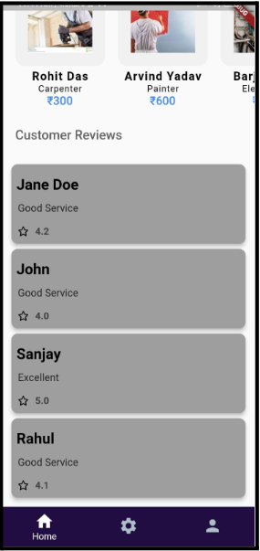
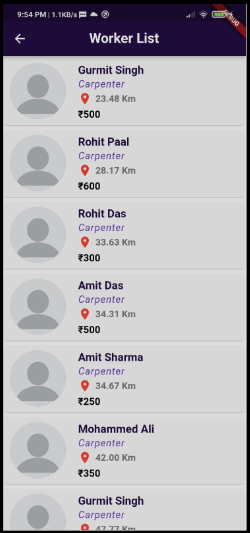
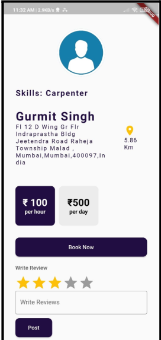
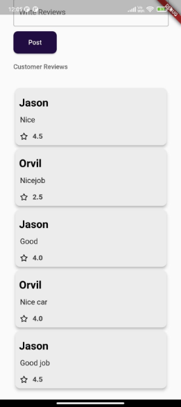
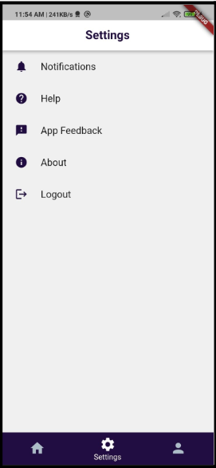
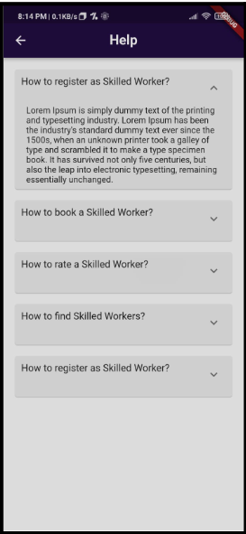
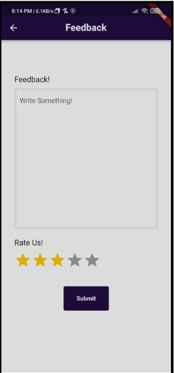

# Mobile Application for finding Skilled workers for daily chores

## Problem Statement

To build a bridge between the Skilled laborers and the locals we intend on designing a mobile application wherein the skilled laborers can promote and market their skills. This app is designed to provide you the Avenue to Contact, Employ, Connect, reach out, and have immediate access with any of your needed skilled workers or service provider within and outside your home, office, or anywhere you are for immediate service delivery. The users can get an overview of the services available. 

Hence our project will include the following features:

1. Registration facility for the skilled workers as well users for authorized access to the system.
2. The users will be able to provide feedback and check reviews.
3. The system will show a list of the skilled workers who are located near the user’s area.
4. The user can select the skilled worker they prefer based on ratings provided by others users.

## Output

&emsp;

&emsp;

&emsp;

&emsp;

&emsp;

&emsp;

&emsp;

&emsp;

&emsp;

&emsp;

## Contributor

- [Steve Gonasalves](https://github.com/leahdsouza)
- [Orvil D'silva](https://github.com/orvil1026)
- [Jason Dsouza](https://github.com/JasonD13)
- [Ralph Dsouza](https://github.com/RD0410)
